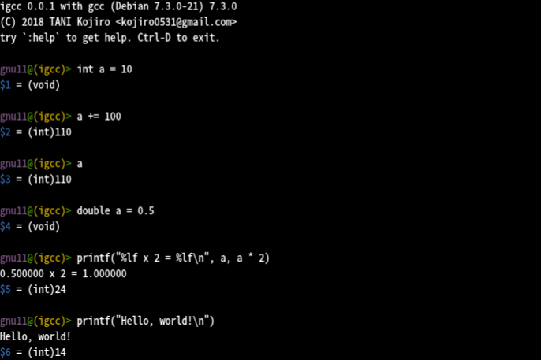

# ***Warning; WIP!***
The software is still pre-alpha quality. Use at your own risks.

# igcc - yet another interactive shell for C development
## Overview
igcc is an interactive shell for C development, 
which can be utilized like REPL (Read-Eval-Print-Loop)
 for dynamic languages such as Lisp.
It would be useful for testing new libraries or learning C language.
igcc is basically a thin wrapper around gcc, 
which invokes the compiler for each lines. 
Its features and limitations are listed below:

**Features**
- written in less than 200 lines of bash script
- line editting with GNU Readline
- some useful commands

**Limitations**
- do not support C preprocessor directives
- getting user input in C does not work correctly

The above limitations are caused by igcc to evaluate all input history every time.

## Requirements
- Bourne-again shell (bash) > 4.2
- GCC > 4.9

## Installation

Just put the script (igcc) into anywhere included in PATH.

## Usage

See the screenshot below:

## See also
- [CINT](http://www.hanno.jp/gotom/Cint.html) - a C/C++ interpreter which supports ANSI-C
- [Cling](https://root.cern.ch/cling) - a C++ interpreter built on the top of LLVM and Clang
- [PicoC](https://gitlab.com/zsaleeba/picoc) - a small C interpreter, comes with REPL
- [TCC](https://bellard.org/tcc/tcc-doc.html#SEC1) - an embedable C compiler

# License
Distributed under [GPLv3](LICENSE)

# Author
[TANI Kojiro](https://github.com/koji-kojiro)\<kojiro0531@gmail.com\>
